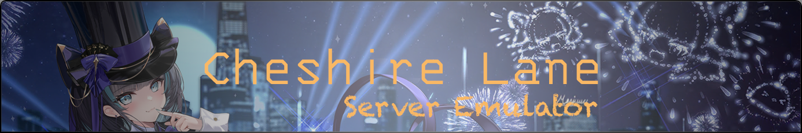

# CheshireLane (Public Version)
*A Proof-of-Concept Private Server for an Anime Fleet Game*

## 🚨 Disclaimer

> **This project is strictly for educational and research purposes only.**  
> Any unauthorized or unlawful use is strictly prohibited.

- **You are responsible** for ensuring compliance with all applicable laws and regulations when using this project.
- **The author and contributors bear no liability** for any misuse, illegal activities, or consequences resulting from its use.
- This project is **open-source and free software**.
    - ❌ **Commercial use is strictly prohibited**
    - This includes but is not limited to:
        - Selling or monetizing services
        - Integrating it into paid products

---

## 🚀 Getting Started

### 1️⃣ Clone the Repository
```bash
git clone https://github.com/Irminsul-dev/CheshireLane-Public.git CheshireLane
cd CheshireLane
```

### 2️⃣ Start Infrastructure (via Docker Compose)
Ensure you have [Docker Compose](https://docs.docker.com/compose/) installed:
```bash
cd infrastructure
docker-compose up -d
```

### 3️⃣ Run the Server

#### ✅ Using `xtask` (Recommended)
```bash
cargo xtask run        # Runs sdk-server, dispatch-server, and gate-server
cargo xtask run-game   # Runs game-server
```

#### 🔧 Manual Start
```bash
cargo build
cargo run --bin sdk-server
cargo run --bin dispatch-server
cargo run --bin gate-server
cargo run --bin game-server
```

### 4️⃣ Traffic Forwarding

- HTTP/HTTPS: azurusapi.yo-star.com ➡️ sdk-server
- TCP: blhxusgate.yo-star.com:80 ➡️ gate-server

You can forward traffic using one of the following methods:

- Modify Game Client
- Modify `iptables`
- Use a Transparent Proxy

---

## 🎬 Example

https://github.com/user-attachments/assets/e3d88f0b-7d9e-4179-8f54-2a0b75c7a43d

---

## ⚠️ Public Version Limitations

To avoid legal issues, the **Public version** includes the following restrictions:

1. **Reverse engineering-related files and tools have been removed**.
2. **Only the skin preview feature is available**—all other game functionalities are not implemented.
3. **The original proto files will not be provided** in the Public version.

---

## 🙏 Acknowledgements

Special thanks to the following open-source projects and organizations for their contributions to the community:

- [AzurLaneTools](https://github.com/AzurLaneTools)
- [BLHX.Server](https://github.com/rafi1212122/BLHX.Server)
- [AzurLane-AssetDownloader](https://github.com/nobbyfix/AzurLane-AssetDownloader)
- [evelyn-rs](https://git.xeondev.com/evelyn-rs/evelyn-rs)
- [mavuika-rs](https://git.xeondev.com/mavuika-rs/mavuika-rs)

---

## 📜 License

This project is licensed under the **[AGPL-3.0 License](./LICENSE)**.
